# plsql-window-functions-bikorimana-eric

## Table of Contents

- [Requirement](#13)
- [Problem Definition](#37)
- [Success Criteria](#55)
- [Database Schema Design](#77)
- [Window Function Implementation](#196)
- [Results Analysis](#218)
- [References](#235)

## Requirement

1. **Database Environment**

- [Oracle Database](https://www.oracle.com/database/) (Version: Oracle XE): Used for to store and retrieve related information.

2. **Database Client Tools**

- **Oracle SQL Developer:** develop and manage SQL databases by planning, developing, and maintaining the databases.

3. **Development Tools**

- [Visual Studio Code](https://code.visualstudio.com/download) (for editing `.sql`):

4. **Version Control**

- [Git](https://git-scm.com/): is a distributed version control system designed to track changes in source code during software development.
- [Github](https://github.com/): is a cloud-based platform where you can store, share, and work together with others to write code

5. **Diagram Tools**

- [Draw.io](http://Draw.io) ([diagrams.net](http://diagrams.net)) to create the ER Diagram.

## 1. Problem Definition

A. **Business Context:**
Isokko App is an online retail and distribution company that’s spread out across different parts of Rwanda. We’re particularly interested in their Business Intelligence (BI) department, which helps them make smart decisions by using data. They’re in the consumer goods and retail industry.
    
B. **Data Challenge**:
Isokko App needs to understand which products perform best in different regions and how customer behavior changes over time. They require insights to improve their marketing strategies and inventory management decisions.
  
C. **Expected Outcome**: By using **PL/SQL window functions**, the company will uncover:
  
- Top-selling products per region/district in Rwanda.
- track monthly sales trends
- Customer segmentation by spending
- analyze growth rates

## 2. Success Criteria

* **Top 5 products per region/quarter** → Using `RANK()`

> This function helps to **rank products** based on sales within specific categories like region and quarter, identifying top performers.

* **Running monthly sales totals** → Using `SUM() OVER()`

> This function is used to calculate **running totals of sales** month-over-month, showing cumulative progress throughout the year.

* **Month-over-month growth percentage** → Using `LAG()`

> These functions facilitate the measurement of  **month-over-month growth** , highlighting performance trends and the impact of business initiatives.

* **Customer spending quartiles** → Using `NTILE(4)`

> This function helps to **segment customers into quartiles** based on spending, which is useful for targeted marketing strategies.

* **3-month moving average of sales** → Using `AVG() OVER()`

> This function is used to compute a  **3-month moving average** , which smooths out short-term sales fluctuations and reveals underlying trends.

## 3. Database Schema

1. **Create user called plsql by using cmd**
   
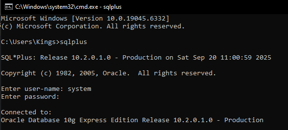

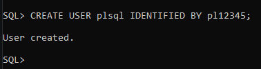

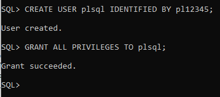

2. **Create a connection in SQL Developer**

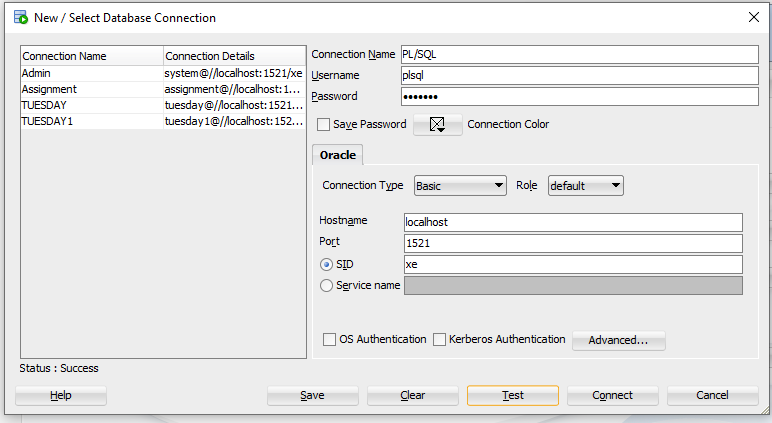

### Tables

See all tables created queries [here](sql/01_sql_schema.sql)

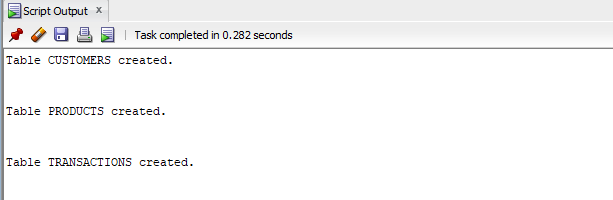

> Tables created 

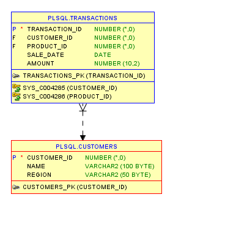

> Customer-Transaction Relationship

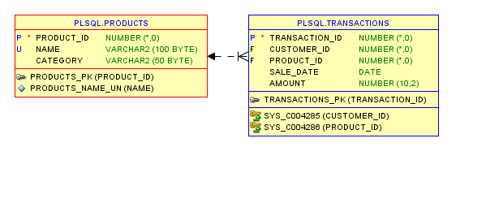

> Product-Transaction Relationship

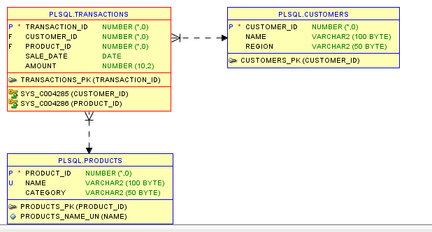

> Customers-Transactions-Products Relationship

3. **Insert sample data into tables**

See all queries to insert sample date into tables [here](sql/02_sample_data.sql)

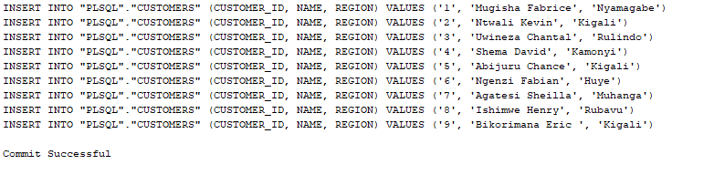

> Insert customers sample data into Customers table

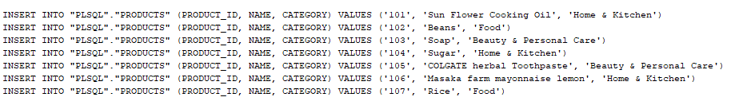

> Insert products sample data into Products table

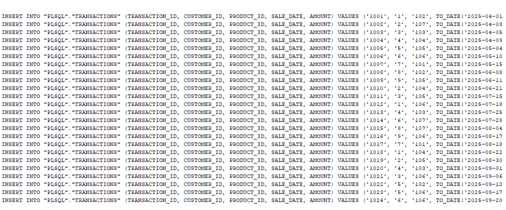

> Insert transactions sample data into Transactions table

### ER Diagram

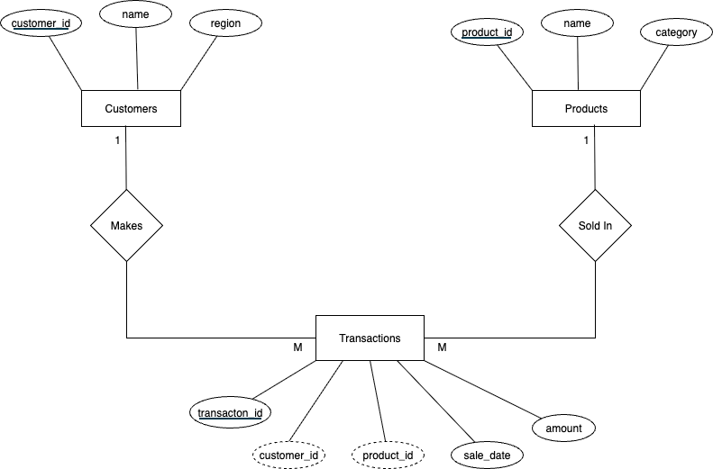

**Relationships:**

* **CUSTOMERS** →  **TRANSACTIONS** : "MAKES" relationship (1:M) - One customer can make many transactions
* **PRODUCTS** →  **TRANSACTIONS** : "SOLD IN" relationship (1:M) - One product can be sold in many transactions

## 4. Window Function Implementation

See all window function implementation queries [here](sql/03_result_queries.sql)

* Ranking: ROW_NUMBER(), RANK(), DENSE_RANK(), PERCENT_RANK() Use case: Top N customers by revenue

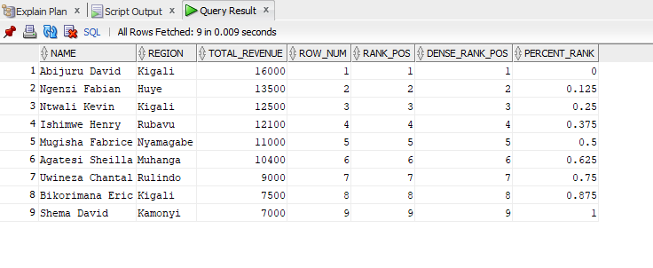

>Interpretation: This query ranks customers by total revenue using multiple functions that handle ties and relative
>positioning. It helps identify top spenders and segment customers based on their contribution to overall sales.
> See the result [here](sql/03_result_queries.sql)

* Aggregate: SUM(), AVG(), MIN(), MAX() with frame comparisons (ROWS vs RANGE) Use case: Running totals & trends

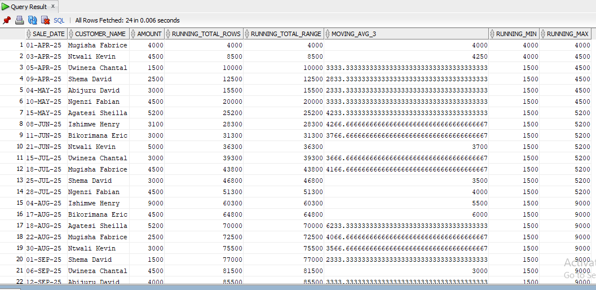

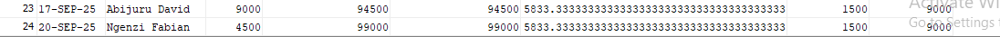

>Interpretation: This query tracks cumulative and rolling metrics over time using different window frames. It helps
>monitor sales growth, detect anomalies, and smooth fluctuations for trend analysis and forecasting.
> See the result [here](sql/03_result_queries.sql)

* Navigation: LAG(), LEAD(), growth % calculations Use case: Period-to-period analysis

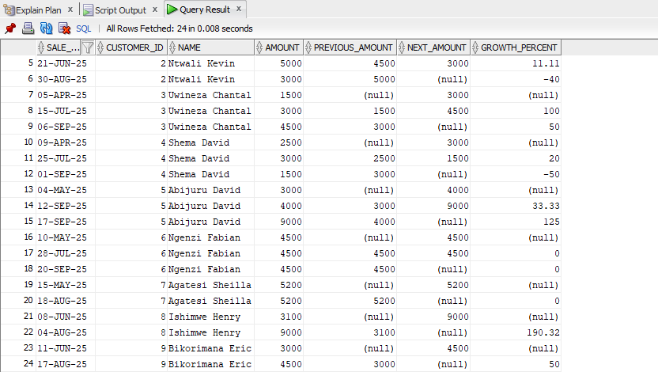

>Interpretation: LAG() and LEAD() access previous and next row values within partitions, enabling period-to-period comparisons.
>Growth percentage calculations become straightforward by comparing current values with previous ones using LAG().        
> See the result [here](sql/03_result_queries.sql)

* Distribution: NTILE(4), CUME_DIST() Use case: Customer segmentation

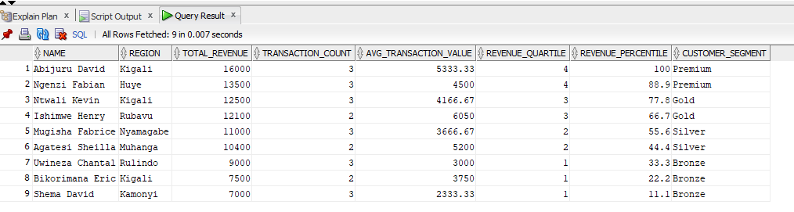

> Interpretation: This query segments customers into quartiles and percentiles based on total revenue. It assigns intuitive 
>labels like Premium, Gold, Silver, and Bronze to support targeted marketing and loyalty strategies.
> See the result [here](sql/03_result_queries.sql)

## 5. Results Analysis

### Descriptive – What Happened?

- Kigali consistently tops the customer revenue charts, with a few big spenders making up a lot of the pie.
- Q2 saw steady growth, but Q3 hit a bit of a plateau.
- Individual customer spending showed some big spikes, especially among our Premium-tier clients.
- We found a small group of high-value customers who are really contributing to our total revenue.

### Diagnostic – Why Did It Happen?

- Kigali is dominance is likely driven by urban density and higher purchasing power.
- Q2 growth matches seasonal promotions and more frequent transactions from our loyal customers.
- Our Premium customers are consistently making big purchases, which suggests bulk buying or institutional buying.
- Our Bronze and Silver segments have fewer transactions and lower average values, which means they’re probably casual or infrequent shoppers.
  
### Prescriptive – What next?

- We should focus on inventory and marketing in Kigali and among our Premium-tier customers to maximize our ROI.
- We should replicate the Q2 promotional strategies in Q4 to boost demand and performance at the end of the year.
- We should launch targeted campaigns for Gold and Silver segments to encourage upselling and repeat purchases.
- Monitor moving averages and growth metrics monthly to anticipate demand shifts and adjust supply chain planning.

## 6. References

* [Isokko App](https://app.isokko.com/) (2025) for Product categorization reference.
* [Oracle Docs](https://docs.oracle.com/en/database/oracle/oracle-database/index.html) : Analytic Functions. Oracle Help Center.
* [TutorialsPoint](https://www.tutorialspoint.com/apache_tajo/apache_tajo_aggregate_and_window_functions.htm) (2025). *Aggregate & Window Functions*.
* [GeeksforGeeks](https://www.geeksforgeeks.org/sql/window-functions-in-sql/) (2025). *SQL Window Functions*.
* Youtube video: [Lead &amp; Lag Window Functions in SQL (EXAMPLES INCLUDED)](https://www.youtube.com/watch?v=nHEEyX_yDvo)
* [SQL ServerCentral](https://www.sqlservercentral.com/articles/window-function-basics-partition-by) (2025). *Window function basics PARTITION BY*.
* [SQLTutorial](https://www.sqltutorial.org/sql-window-functions/) (2025). *SQL Window Functions*.
* [Mode Analytics](https://mode.com/sql-tutorial/sql-window-functions) (2025). *SQL Window Functions*.
* [TechOnTheNet](https://www.techonthenet.com/oracle/index.php) (2025). *Oracle/PLSQL Analytical Functions*.
* Academic paper:
Prof. Dr,-Ing . Stefan deßloch. (2014). Recent Develepments for Data Models. - [Chapter 6 - Windows and Query Functions in SQL](http://wwwlgis.informatik.uni-kl.de/cms/fileadmin/courses/SS2014/Neuere_Entwicklungen/Chapter_6_-_Windows_and_Query_Functions_in_SQL.pdf)

## Integrity Statement

I declare that this project is my own work. It has been completed with honesty and integrity, without plagiarism or unauthorized collaboration.  
All sources, references, and external resources used have been properly acknowledged.  

**Author:** BIKORIMANA Eric
**Date:** 2025-09-29

